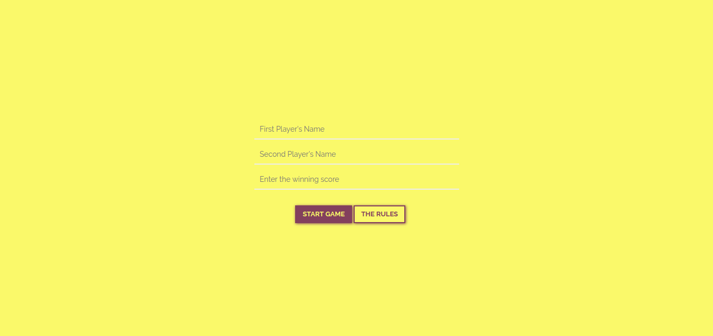
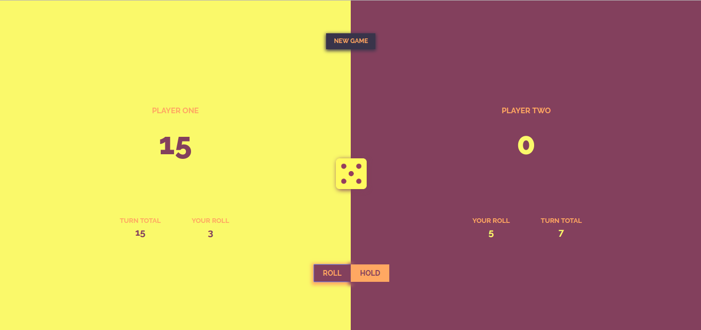

# Pig Dice

###### Authored by Michael Kipchumba

[Link to live site](https://mikechumba.github.io/pigdice/)

This is a simple game of pig dice made using Javascript. Two users can get to play against each other by taking turns at the game. The person who reaches the set winning score first wins the game. The default winning score is 100 but the players can set the winning score themselves.

*The first page where the players can enter their names and winning score if they so chose to.*

*Our pig dice game.*

### Project Approach
   
| Action       | Result       | After  |
| ------------- |:-------------:| -----:|
| Click on roll      | display random number between 1 and 6 | Add that number to the turn total |
| Click on hold      | Adds the turn total to the overall score      |   The turn goes to the other player |
| When a player's overall score is equal to or greater than the winning score (default is 100) | The player wins | game ends |

### Project Tools

##### Languages

- HTML5
- CSS3
   - Bootstrap
- Javascript
   - jQuery

###### Other

- Fonts (Raleway) from [Google Fonts](fonts.google.com).

### Debugging

The web app doesn't seem to have any bugs this far. If you happen to come across one, I will be happy to have a look at it. Contact Me on:

- [Facebook](https://web.facebook.com/ItsMikeChumba/)
- [Email](michaelchumba09@gmail.com)

### License 

MIT License

Copyright (c) 2018 Michael Kipchumba

Permission is hereby granted, free of charge, to any person obtaining a copy
of this software and associated documentation files (the "Software"), to deal
in the Software without restriction, including without limitation the rights
to use, copy, modify, merge, publish, distribute, sublicense, and/or sell
copies of the Software, and to permit persons to whom the Software is
furnished to do so, subject to the following conditions:

The above copyright notice and this permission notice shall be included in all
copies or substantial portions of the Software.

THE SOFTWARE IS PROVIDED "AS IS", WITHOUT WARRANTY OF ANY KIND, EXPRESS OR
IMPLIED, INCLUDING BUT NOT LIMITED TO THE WARRANTIES OF MERCHANTABILITY,
FITNESS FOR A PARTICULAR PURPOSE AND NONINFRINGEMENT. IN NO EVENT SHALL THE
AUTHORS OR COPYRIGHT HOLDERS BE LIABLE FOR ANY CLAIM, DAMAGES OR OTHER
LIABILITY, WHETHER IN AN ACTION OF CONTRACT, TORT OR OTHERWISE, ARISING FROM,
OUT OF OR IN CONNECTION WITH THE SOFTWARE OR THE USE OR OTHER DEALINGS IN THE
SOFTWARE.